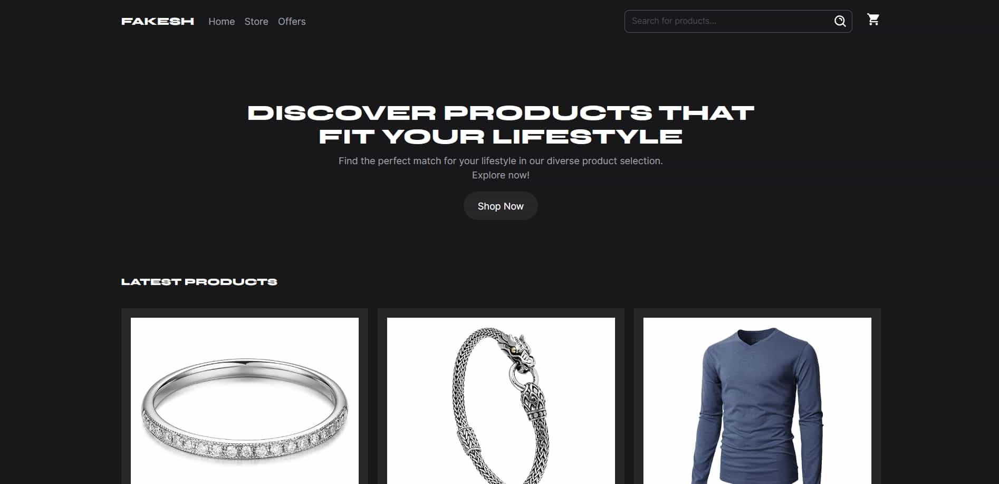

# Proyecto de Ecommerce Frontend

Este proyecto frontend de un ecommerce se ha desarrollado con el propósito de poner a prueba y mejorar los conocimientos en el desarrollo web utilizando tecnologías modernas como Next.js, TypeScript y Tailwind CSS. Utiliza la Fake Store API como fuente de datos para productos ficticios.

## Descripción

El objetivo principal de este proyecto es consolidar y expandir los conocimientos adquiridos en el desarrollo frontend, aplicando conceptos y buenas prácticas aprendidas. A través de la implementación de un frontend funcional para un ecommerce, se pretende demostrar habilidades en la creación de interfaces de usuario atractivas, la gestión de estado, la manipulación de datos y la interacción con APIs externas.

## Características

- Integra la Fake Store API para obtener y mostrar datos de productos ficticios.
- Implementa una interfaz de usuario intuitiva y atractiva para la navegación y compra de productos.
- Utiliza TypeScript para mejorar la calidad y robustez del código.
- Aplica Tailwind CSS para un diseño eficiente y personalizable.
- Incluye funcionalidades básicas como búsqueda de productos, navegación por categorías y gestión del carrito de compras.

## Tecnologías Utilizadas

- **Next.js**: Framework de React para aplicaciones web que ofrece renderizado del lado del servidor y en el cliente.
- **TypeScript**: Lenguaje de programación tipado que proporciona mayor seguridad y mantenibilidad al código.
- **Tailwind CSS**: Framework CSS utilitario que facilita la creación de interfaces de usuario personalizadas y responsivas.
- **Fake Store API**: API pública que proporciona datos ficticios de productos para propósitos de desarrollo y pruebas.
